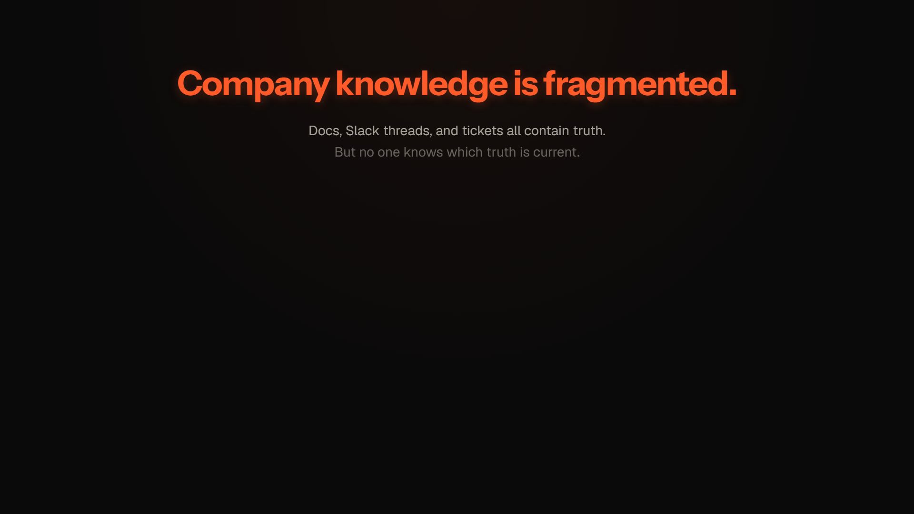
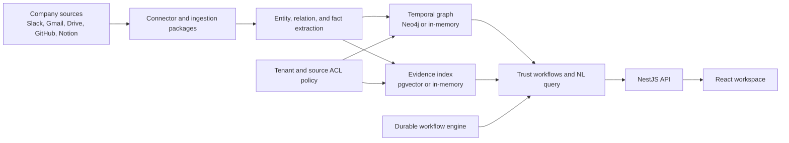

# AgentMesh

AgentMesh is a permission-aware, temporal company-brain platform built on a durable workflow engine. It connects company sources, turns their contents into evidence-backed facts and entities, tracks how those facts change, and serves cited answers and repeatable workflows.

The system combines:

- A bitemporal knowledge graph for current and historical truth.
- Vector retrieval with tenant and source permission filtering.
- Cross-source entity resolution and correction workflows.
- Cited, confidence-scored answers with explicit abstention.
- Durable orchestration for long-running agents, retries, queues, schedules, and human approval.
- A React workspace for asking questions, reviewing evidence, running briefs, managing sources, and operating workflows.

[](ui/public/agentmesh-demo.mp4)

## Contents

- [Product model](#product-model)
- [Current status](#current-status)
- [Architecture](#architecture)
- [Repository layout](#repository-layout)
- [Prerequisites](#prerequisites)
- [Quick start](#quick-start)
- [Configuration](#configuration)
- [Using the web application](#using-the-web-application)
- [API overview](#api-overview)
- [Security and permission model](#security-and-permission-model)
- [Development workflows](#development-workflows)
- [Testing](#testing)
- [Docker development stack](#docker-development-stack)
- [Nested Knowledge OS workspace](#nested-knowledge-os-workspace)
- [Known limitations](#known-limitations)
- [Documentation](#documentation)
- [Licensing](#licensing)

## Product model

AgentMesh treats company knowledge as changing, permissioned evidence rather than a collection of static documents.

### Ingestion and memory

Connector packages read external systems such as Slack, Gmail, Google Drive, GitHub, and Notion. The intended ingestion path is:

1. Fetch source records and preserve source identifiers and ACL metadata.
2. Persist raw payload references and normalized content.
3. Extract entities, relationships, facts, timestamps, and evidence spans.
4. Resolve duplicate entities across source systems.
5. Write temporal facts and provenance into the graph.
6. Index retrievable evidence in the vector store.
7. Run supersession and contradiction detection.

Connector ACL metadata must be stored before extracted facts become retrievable. Unknown ACL state fails closed.

### Temporal facts

Facts carry two time dimensions:

- **Valid time** describes when a fact was true in the real world.
- **Recorded time** describes when AgentMesh learned, changed, or invalidated it.

This supports questions such as:

- What is true now?
- What did the company believe last month?
- Which source changed the answer?
- Which earlier fact or document was superseded?
- Are current sources contradictory?

### Trusted answers

Natural-language queries and first-party workflows retrieve permission-visible evidence, calculate confidence, attach citations, and abstain when the available material is missing or contradictory.

The primary workflows are:

| Workflow | Purpose |
| --- | --- |
| Onboarding brief | People, projects, terminology, documents, decisions, and recommended reading for a new team member |
| Weekly digest | Decisions, completed work, blockers, changed deadlines, risks, and open questions |
| Incident brief | Timeline, impact, owners, linked evidence, root cause, and unresolved follow-ups |
| Meeting prep | Previous decisions, attendee context, action items, account or project history, and suggested questions |
| Account summary | Customer state, risks, requests, meetings, opportunities, and internal ownership |
| Growth brief | Campaign funnel quality, feature response, revenue evidence, superseded assumptions, and recommended actions |

## Current status

AgentMesh has a substantial graph, retrieval, and orchestration foundation, but it is not yet production-ready as a complete company-brain deployment.

### Implemented and verified capability slices

- Vector search with pgvector, HNSW indexing, local and hosted embedding providers, reindexing, evaluation, and permission filtering.
- Neo4j-backed tenant-scoped temporal reads and correction primitives.
- Exact, alias, and fuzzy cross-source entity resolution with automatic merge and reassignment.
- Permission filtering across graph reads, temporal queries, vector retrieval, citations, conflicts, and trust workflows.
- Fail-closed handling when a source has no known ACL mapping.
- Admin-gated graph mutation and maintenance operations.
- Disabled arbitrary Cypher execution through tenant HTTP APIs.
- Cited trust workflows with no-evidence and contradiction abstention.
- React workspace, landing page, chat history, source management, workflow views, growth brief, operational dashboards, and settings.
- SQLite-backed local orchestration with workflow workers, task queues, schedulers, and event streaming.

### Highest-priority production work

1. Install production OAuth/OIDC verification across all server surfaces.
2. Persist users, tenants, memberships, roles, groups, grants, and connector service identities.
3. Repair and consolidate the nested `company-knowledge-os` workspace.
4. Complete real connector ingestion, cursor persistence, content retrieval, rate limiting, webhook verification, and ACL synchronization.
5. Make queue pop, unacknowledged-message recovery, and scheduler persistence fully durable.
6. Replace fixed confidence features with measured retrieval and source-quality signals.
7. Expand operator views for connector health, retrieval quality, permission failures, and correction review.

See [passes.md](passes.md) for the production-readiness roadmap and [pivot.md](pivot.md) for the detailed company-brain requirements.

## Architecture



### Major runtime layers

| Layer | Main packages | Responsibility |
| --- | --- | --- |
| Domain contracts | `common` | Zod models, workflow/task types, enums, and vector-search contracts |
| Persistence contracts | `common-persistence` | DAO interfaces for executions, metadata, queues, connections, and related state |
| Workflow engine | `core` | Decider, execution lifecycle, system tasks, retries, and sweeper |
| Graph and retrieval | `graph-service` | Temporal facts, Neo4j, vector search, corrections, entity resolution, and policy enforcement |
| Trust workflows | `workflow-service` | First-party briefs, natural-language query, citations, confidence, streaming, and abstention |
| REST compatibility | `rest` | Orchestration, task, metadata, admin, connection, webhook, and OAuth controllers |
| Application server | `server-lite` | NestJS bootstrap, SQLite wiring, workers, schedules, runtime agents, and static UI serving |
| Agent runtime | `agent-runtime` | Agents, tools, workers, routines, and LLM execution |
| AI providers | `ai` | Anthropic and Gemini providers plus model routing |
| Primary UI | `ui` | React 19, Vite, React Query, and optional Tauri packaging |
| Legacy UI | `ui-next` | Older React 18/MUI interface; only still-needed features should be ported |
| Root connector package | `knowledge-os` | Connector contracts and root-workspace connector code |
| Nested connector workspace | `company-knowledge-os` | Connector, database, extraction, episode, and ingestion packages under separate pnpm/turbo configuration |

The root workspace and `company-knowledge-os/` are intentionally separate. The nested workspace is not included in the root `pnpm-workspace.yaml`.

## Repository layout

```text
agent-mesh/
├── agent-runtime/          Agents, tools, routines, workers, and runtime execution
├── ai/                     LLM provider implementations and routing
├── common/                 Shared domain models and contracts
├── common-persistence/     Persistence interfaces
├── common-storage/         File and external payload storage interfaces
├── company-knowledge-os/   Nested pnpm/turbo connector and ingestion workspace
├── core/                   Durable workflow engine
├── graph-service/          Temporal graph, policy, vector retrieval, and corrections
├── knowledge-os/           Root-workspace connector contracts
├── rest/                   NestJS API controllers and services
├── server-lite/            Runnable application server
├── sqlite-persistence/     Local execution, queue, and metadata persistence
├── workflow-service/       Trusted query and brief workflows
├── ui/                     Primary React application
├── ui-next/                Legacy frontend
├── chaos-suite/            Crash and restart integration coverage
├── docker-compose.yml      Local Postgres, Redis, Neo4j, and server stack
├── passes.md               Production-readiness roadmap
└── pivot.md                Detailed product requirements
```

See [AGENTS.md](AGENTS.md) for canonical coding-agent instructions, security invariants, package ownership, and the most recently verified baseline.

## Prerequisites

Required for root-workspace development:

- Node.js 20 or newer.
- pnpm 10.33.2 through Corepack or a compatible pnpm installation.
- Git.

Recommended:

- Docker Desktop or another Docker Compose implementation for Postgres/pgvector, Redis, and Neo4j.
- PowerShell 7 on Windows.

Enable the repository package manager:

```powershell
corepack enable
corepack prepare pnpm@10.33.2 --activate
```

On Windows, use `pnpm.cmd` if PowerShell execution policy blocks `pnpm.ps1`.

## Quick start

### 1. Install dependencies

From the repository root:

```powershell
pnpm.cmd install
```

### 2. Create local configuration

```powershell
Copy-Item .env.example .env
```

The default local path can use SQLite and in-memory graph/search fallbacks. Hosted LLM tasks require at least one provider key. Production-style graph and retrieval require Neo4j and pgvector configuration.

### 3. Start the API server

In one terminal:

```powershell
pnpm.cmd --filter @agentmesh/server-lite dev
```

The default endpoints are:

- Health check: [http://localhost:8080/health](http://localhost:8080/health)
- Swagger UI: [http://localhost:8080/api/docs](http://localhost:8080/api/docs)
- API base: `http://localhost:8080/api`

### 4. Start the frontend

In another terminal:

```powershell
pnpm.cmd --filter agent-mesh-frontend dev
```

Open:

- Landing page: [http://localhost:5173/](http://localhost:5173/)
- Application workspace: [http://localhost:5173/home](http://localhost:5173/home)

Vite proxies `/api` and `/health` to the server on port 8080.

### 5. Build the production frontend

```powershell
pnpm.cmd --filter agent-mesh-frontend build
```

`server-lite` serves the generated `ui/dist` directory when the application is run from a built workspace:

```powershell
pnpm.cmd --filter @agentmesh/server-lite build
pnpm.cmd --filter @agentmesh/server-lite start
```

After a frontend build, check `ui/dist/index.html`. Its generated asset hash can change even when no UI source was intentionally modified.

## Configuration

The complete local template is [.env.example](.env.example).

### Server and persistence

| Variable | Purpose | Typical local value |
| --- | --- | --- |
| `PORT` | HTTP port | `8080` |
| `NODE_ENV` | Runtime mode | `development` |
| `LOG_FORMAT` | Morgan HTTP log format | `dev` |
| `AGENTMESH_VERSION` | Reported application version | Value from `VERSION` |
| `DB_PATH` | SQLite database file; omit or use an in-memory configuration for ephemeral runs | `./data/agentmesh.sqlite` |
| `QUEUE_PROVIDER` | Task queue implementation | `sqlite` |
| `RABBITMQ_URL` | RabbitMQ connection when the AMQP provider is enabled | `amqp://localhost:5672` |
| `REDIS_URL` | Distributed locks and cache | `redis://localhost:6379` |
| `DEMO_AUTH` | Enables the local trusted demo principal outside production | Defaults on outside production |
| `DEMO_SEED` | Seeds local company-brain demonstration data | Defaults on outside production |

### LLM and execution providers

| Variable | Purpose |
| --- | --- |
| `ANTHROPIC_API_KEY` | Anthropic-backed agent tasks |
| `GEMINI_API_KEY` | Gemini LLM and embedding tasks |
| `OPENAI_API_KEY` | OpenAI embedding provider when selected |
| `MODEL_EXECUTE` | Optional execution-model override |
| `E2B_API_KEY` | E2B sandbox-backed code execution |

If no supported LLM key is present, some local agent paths use a stub provider. Do not interpret stub output as production behavior.

### Vector retrieval

| Variable | Purpose | Production guidance |
| --- | --- | --- |
| `EMBEDDING_PROVIDER` | `openai`, `gemini`, or deterministic local provider | Use a hosted provider in deployed environments |
| `EMBEDDING_MODEL` | Provider model identifier | Must match the configured dimensions |
| `EMBEDDING_DIMENSIONS` | Vector dimensions | Keep consistent with the database index |
| `EMBEDDING_TIMEOUT_MS` | Provider request timeout | Tune using observed latency |
| `EMBEDDING_MAX_ATTEMPTS` | Retry attempts | Keep bounded |
| `EMBEDDING_CONCURRENCY` | Parallel embedding calls | Tune against provider limits |
| `VECTOR_STORE` | `pgvector` or in-memory implementation | Use `pgvector` for persistence |
| `VECTOR_DATABASE_URL` | PostgreSQL connection containing the vector extension | Required for pgvector |
| `VECTOR_HNSW_EF_SEARCH` | HNSW query breadth | Higher values trade latency for recall |
| `ALLOW_DETERMINISTIC_EMBEDDINGS` | Enables test/local deterministic embeddings | Keep `false` in production |
| `ALLOW_IN_MEMORY_VECTOR_STORE` | Enables ephemeral vector storage | Keep `false` in production |

### Temporal graph

| Variable | Purpose |
| --- | --- |
| `NEO4J_URI` | Bolt URI; unset uses the in-memory graph fallback |
| `NEO4J_USER` | Neo4j user, normally `neo4j` |
| `NEO4J_PASSWORD` | Required when `NEO4J_URI` is configured |

### Authentication and authorization

The graph and trust-workflow controllers consume a verified `request.user`. Relevant claim mapping variables include:

- `JWT_SECRET`
- `OIDC_TENANT_CLAIM`
- `OIDC_ROLES_CLAIM`
- `OIDC_GROUPS_CLAIM`

Production-wide OIDC installation and durable grant storage remain active roadmap items. Do not expose a deployment publicly based only on local demo or test authentication.

### Webhooks and external integrations

| Variable | Purpose |
| --- | --- |
| `SLACK_SIGNING_SECRET` | Verifies Slack webhook signatures |
| `GITHUB_WEBHOOK_SECRET` | Verifies GitHub webhook signatures |
| `LINKEDIN_CLIENT_ID`, `LINKEDIN_CLIENT_SECRET` | LinkedIn OAuth |
| `THREADS_APP_ID`, `THREADS_APP_SECRET` | Threads OAuth |
| `FACEBOOK_APP_ID`, `FACEBOOK_APP_SECRET` | Facebook OAuth |
| `INSTAGRAM_APP_ID`, `INSTAGRAM_APP_SECRET` | Instagram OAuth |
| `SCALEKIT_CLIENT_ID`, `SCALEKIT_CLIENT_SECRET` | Scalekit-managed OAuth |
| `PUBLIC_URL` | Public callback base URL |
| `SOCIAL_TOKENS_PATH` | Local encrypted/migrated social-token storage path |

Webhook routes fail closed until their signing secret is configured.

### Observability

Set `LANGFUSE_PUBLIC_KEY`, `LANGFUSE_SECRET_KEY`, and optionally `LANGFUSE_BASE_URL` to enable Langfuse tracing.

## Using the web application

The primary UI is in `ui/`.

| Route | Purpose |
| --- | --- |
| `/` | Public product landing page and embedded product overview video |
| `/home` | New cited company-brain conversation |
| `/ask` | Locally stored conversation history |
| `/briefs` | First-party workflow and brief views |
| `/growth` | Founder growth brief over seeded campaign evidence |
| `/routines` | Recurring or event-driven agent routines |
| `/knowledge` | Knowledge and retrieval exploration |
| `/activity` | Live application and workflow events |
| `/admin` | Operations overview |
| `/admin/sources` | Connection and source management |
| `/admin/automation` | Workflow automation surface |
| `/admin/audit` | Audit, approval, and safety views |
| `/settings` | Appearance, runtime, integration, observability, and safety settings |
| `/workflows/*` | Legacy-compatible workflow definition and execution views |
| `/tasks/*` | Task definitions and queue views |
| `/events/*` | Event handlers and event queues |
| `/schedulers/*` | Scheduler management |

Chat transcripts are currently stored in browser local storage. The backend query endpoint remains stateless per request.

The landing-page video is stored at `ui/public/agentmesh-demo.mp4`, with `ui/public/agentmesh-demo-poster.jpg` used as its loading poster.

## API overview

Swagger is the canonical interactive reference:

[http://localhost:8080/api/docs](http://localhost:8080/api/docs)

### Natural-language query

```http
POST /api/workflows/query
Content-Type: application/json
Authorization: Bearer <verified-token>

{
  "query": "Why did the Atlas launch move?",
  "projectId": "project-atlas"
}
```

Streaming answers are available through:

```http
POST /api/workflows/query/stream
```

The streaming route uses server-sent events and emits incremental answer events.

### Trust workflows

```text
POST /api/workflows/onboarding-brief
POST /api/workflows/weekly-digest
POST /api/workflows/incident-brief
POST /api/workflows/meeting-prep
POST /api/workflows/account-summary
POST /api/workflows/campaign-brief
POST /api/workflows/feature-brief
POST /api/workflows/founder-growth-brief
```

Controller request types are defined in `workflow-service/src/api/workflow.controller.ts`.

### Graph and retrieval

```text
GET  /api/graph/metrics
POST /api/graph/search
GET  /api/graph/search/info
POST /api/graph/search/reindex
POST /api/graph/search/evaluate
POST /api/graph/nodes
POST /api/graph/relationships
POST /api/graph/facts
GET  /api/graph/context/:projectId
POST /api/graph/resolve
```

`POST /api/graph/cypher` intentionally rejects arbitrary Cypher. Use the scoped graph endpoints.

### Temporal facts and corrections

```text
GET  /api/graph/facts/current?entity_id=...
GET  /api/graph/facts/history?entity_id=...
GET  /api/graph/facts/as-of?entity_id=...&time=...
GET  /api/graph/facts/changes?entity_id=...&from=...&to=...
GET  /api/graph/facts/conflicts?entity_id=...
POST /api/correct
GET  /api/correct/audit
```

### Orchestration compatibility

The `rest` package exposes workflow definitions, workflow execution, tasks, event handlers, queues, schedulers, metadata, admin operations, connections, webhooks, and social OAuth routes. Read the controllers before relying on an endpoint contract:

- `rest/src/controllers/WorkflowResource.ts`
- `rest/src/controllers/TaskResource.ts`
- `rest/src/controllers/MetadataResource.ts`
- `rest/src/controllers/OrchestrationController.ts`
- `rest/src/controllers/ConnectionsController.ts`
- `rest/src/controllers/WebhookController.ts`

## Security and permission model

AgentMesh applies these boundaries:

- HTTP identity must come from verified middleware-populated `request.user`.
- Body, query, and ad hoc identity headers are not trusted identity sources.
- Tenant scope is applied inside datastore and graph queries, not only after results are returned.
- Source visibility is derived from stored permission hashes.
- Missing source ACL mappings are denied, including for administrators, until ingestion establishes explicit ACL metadata.
- Caller-supplied permission bypass options are removed before vector search.
- Human users, tenant administrators, and connector/service identities require separate policies.
- Graph mutations, reindexing, metrics, entity resolution, and evaluation are administrator operations.
- Arbitrary tenant-supplied Cypher is disabled.
- Corrections and entity merges must synchronize graph state and vector indexes.
- Incoming Slack and GitHub webhooks require signature verification.

Graph-level enforcement is implemented. Production identity verification, durable grants, directory/group synchronization, and connector ACL ingestion are not complete.

## Development workflows

### Root workspace commands

```powershell
# Build all root packages
pnpm.cmd build

# Run all root tests
pnpm.cmd test

# Run lint tasks
pnpm.cmd lint

# Format the repository
pnpm.cmd format
```

Turbo runs package tasks according to dependency order. Root test tasks depend on package builds.

### Focused package commands

```powershell
pnpm.cmd --filter @agentmesh/graph-service build
pnpm.cmd --filter @agentmesh/graph-service test

pnpm.cmd --filter @agentmesh/workflow-service build
pnpm.cmd --filter @agentmesh/workflow-service test

pnpm.cmd --filter @agentmesh/server-lite build
pnpm.cmd --filter @agentmesh/server-lite test

pnpm.cmd --filter agent-mesh-frontend build
pnpm.cmd --filter agent-mesh-frontend test
```

### Broad regression without known Docker-dependent queue suites

```powershell
pnpm.cmd turbo run test --filter=!@agentmesh/nats --filter=!@agentmesh/kafka
```

### Search reindexing

Build the graph service, configure the tenant and vector provider, then run:

```powershell
pnpm.cmd --filter @agentmesh/graph-service reindex-search
```

Relevant variables include `REINDEX_TENANT_ID` and `REINDEX_BATCH_SIZE`.

## Testing

Vitest is used for unit and integration tests.

### Test expectations

- Add focused tests for each behavior change.
- Prefer real implementations and use mocks only around narrow external boundaries.
- Add in-memory coverage for graph and vector behavior.
- Add environment-gated live contracts for Neo4j and pgvector where practical.
- Treat Docker-backed failures as environment failures only when the required service is absent.
- Distinguish commands actually run from outcomes inferred from older baselines.
- Run `git diff --check` before completion.

### Most recently documented stable baseline

The production-readiness report records:

- Root build: 31 of 31 tasks passed.
- Broad non-Docker tests: 57 of 57 tasks passed.
- Graph service: 56 passed and 4 environment-gated skips.
- Server-lite: 8 passed.
- Live Neo4j correction, ingestion-job, and entity-resolution contracts passed.

This is a historical verification snapshot, not a guarantee that an arbitrary dirty worktree currently passes. See [passes.md](passes.md) for its verification date and current defects.

### Environment-dependent suites

- Kafka and NATS contracts need their services or Docker.
- Live Neo4j contracts need `NEO4J_URI`, credentials, and a reachable server.
- Live pgvector contracts need a PostgreSQL database with the vector extension.
- Hosted embedding contracts need valid provider credentials and network access.

## Docker development stack

The root Compose file starts:

- `server`: AgentMesh application on port 8080.
- `db`: PostgreSQL 16 with pgvector on port 5432.
- `redis`: Redis 7 on port 6379.
- `neo4j`: Neo4j 5 browser on port 7474 and Bolt on port 7687.

Start the stack:

```powershell
docker compose up -d --build
```

Inspect health and logs:

```powershell
docker compose ps
docker compose logs -f server
```

Stop it:

```powershell
docker compose down
```

Remove local service volumes only when you intentionally want to destroy local data:

```powershell
docker compose down -v
```

The Compose defaults enable deterministic embeddings for local development. Replace them with a hosted provider for realistic retrieval evaluation.

## Nested Knowledge OS workspace

`company-knowledge-os/` has its own lockfile, workspace definition, and Turbo configuration.

```powershell
Set-Location company-knowledge-os
pnpm.cmd install
pnpm.cmd exec turbo run build
```

The nested workspace is currently under repair. The first known failing package is `@company-knowledge-os/database`. Active problems include:

- Kysely dialect and import errors.
- Incorrect select and insert result typing.
- Unsupported conflict-expression APIs.
- `FactDAO` converting `superseded_by` identifiers into dates.
- Placeholder ingestion episodes instead of real connector and extraction execution.

Do not treat generated `dist` artifacts as evidence that nested source packages compile.

## Known limitations

- Production OAuth/OIDC is not installed consistently across legacy REST and orchestration APIs.
- Authorization grants are process-local rather than durable across instances and restarts.
- Directory and group synchronization is incomplete.
- Connector API behavior, pagination, content extraction, rate-limit handling, webhook verification, and OAuth lifecycle support remain incomplete.
- The nested ingestion orchestrator still creates placeholder episodes.
- SQLite sync queue pop is not atomic.
- Postpone and reschedule paths do not consistently reset `popped`.
- Durable unacknowledged-message recovery and dashboard schedule persistence remain incomplete.
- Trust workflow confidence still includes fixed feature inputs.
- Citation URLs and exact evidence spans need broader connector coverage.
- The operations dashboard does not yet expose the full connector, retrieval, calibration, and permission-error metrics required for production.
- `server-lite` lint has known pre-existing `no-explicit-any` failures.

## Working in the repository

The worktree may contain changes from other agents or the user.

- Inspect `git status` before and after edits.
- Do not reset, revert, overwrite, stage, or reformat unrelated work.
- Keep tenant and source permission checks intact even if older tests expect caller-controlled identity.
- Keep one logical change per eventual pull request.
- Do not include generated-only `ui/dist/index.html` hash changes unless intended.

## Documentation

| Document | Purpose |
| --- | --- |
| [AGENTS.md](AGENTS.md) | Canonical coding-agent instructions, architecture boundaries, commands, and verified state |
| [DESIGN.md](DESIGN.md) | UI typography, color, spacing, motion, and interaction rules |
| [passes.md](passes.md) | Production-readiness report and implementation roadmap |
| [pivot.md](pivot.md) | Detailed product and technical requirements |
| [SECURITY.md](SECURITY.md) | Security policy and reporting guidance |
| [CHANGELOG.md](CHANGELOG.md) | Release history |

## Licensing

This checkout does not currently contain a root `LICENSE` file. Confirm the intended license with the maintainers before redistributing or incorporating the project into another product.
