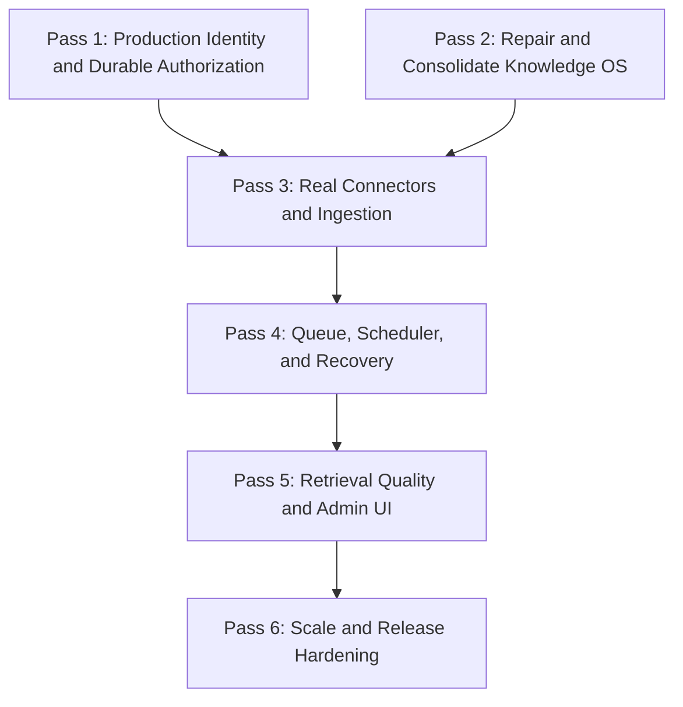

# AgentMesh Production Readiness Report and Action Plan

Last verified: June 20, 2026

This document tracks the remaining work required to operate AgentMesh as a production company-brain platform. It separates completed graph-layer capabilities from application-wide production readiness so that finished work is not repeatedly reopened.

## 1. Executive Summary

The graph and retrieval foundation is now substantially stronger than the previous audit described:

- Vector search is implemented with pgvector and permission-safe retrieval.
- Neo4j temporal reads and corrections use persisted, tenant-scoped data paths.
- Cross-source entity resolution performs real automatic merges.
- Graph and trust-workflow reads enforce source permissions and fail closed.
- Graph mutations require an authenticated tenant administrator.
- Caller-controlled user IDs and permission bypass options are ignored.

The product is not yet production-ready. The main blockers are now:

1. No production OAuth/OIDC middleware or durable authorization store.
2. The nested `company-knowledge-os` workspace does not compile.
3. Connector implementations are incomplete and are not wired into a real ingestion pipeline.
4. Queue recovery and scheduler persistence still have reliability gaps.
5. Confidence calibration remains heuristic, and the admin UI does not expose trust metrics.

### Current Capability Status

| Area | Progress | Current state | Remaining production work |
| --- | ---: | --- | --- |
| Vector and embedding search | 100% | pgvector, HNSW, hosted/local embedding providers, reindexing, evaluation, permission filtering | Operational monitoring and production capacity tuning |
| Neo4j temporal graph and corrections | 100% | Persisted tenant-scoped reads, bitemporal queries, merge/split/update/invalidate corrections, live Neo4j contracts | Large-tenant query benchmarking |
| Cross-source entity resolution | 100% | Exact, alias, and fuzzy matching; automatic merge; reassignment; audit links; idempotency | Review UI and threshold tuning from production data |
| Graph/workflow permission enforcement | 100% | `request.user` identity boundary, source ACL filtering, admin-gated mutations, arbitrary HTTP Cypher disabled | Depends on production identity and durable grants below |
| Production identity and durable authorization | 10% | Controllers expect an upstream verified principal | OIDC/JWT verification, durable grants, tenant membership, group sync, service identities |
| Confidence, citations, and abstention | 75% | Permission-visible citations and contradiction/no-evidence abstention work | Replace fixed scoring inputs, resolve source URLs, improve evidence spans, calibration dataset |
| Natural-language query API | 70% | Secured API returns permission-filtered fact-grounded answers | Better intent/entity resolution, ranking, synthesis, query evaluation corpus |
| Source connectors | 25% | Connector packages and partial API clients exist | Correct API usage, pagination, content retrieval, rate limits, webhook verification, OAuth lifecycle |
| Knowledge OS database and ingestion | 15% | Interfaces, schemas, DAOs, extraction packages, and a Bull-based skeleton exist | Nested workspace build, schema correctness, real connector registry, persisted jobs, extraction pipeline |
| Orchestration reliability | 55% | Durable workflow engine, workers, sweeper, and runtime cron scheduler exist | Atomic sync queue pop, unack recovery, durable dashboard schedules, restart recovery |
| Admin dashboard | 25% | Workflow/status UI and connections screen exist | Connector provisioning, health, sync lag, retrieval metrics, permission errors, correction review |

`100%` in this table means the defined capability slice is implemented and tested. It does not mean the entire product is production-ready.

## 2. Verification Snapshot

The current root workspace was verified with:

- Root build: 31 of 31 package tasks passed.
- Broad non-Docker regression: 57 of 57 tasks passed.
- Graph service: 56 tests passed; 4 environment-gated contracts skipped in the normal run.
- Server-lite: 8 tests passed, including the trust-layer end-to-end flow.
- Live Neo4j contracts: entity resolution, corrections, and ingestion jobs passed.
- Kafka and NATS contract suites remain Docker-dependent.

The nested `company-knowledge-os` workspace is separate from the root workspace and currently fails:

```powershell
cd company-knowledge-os
pnpm exec turbo run build
```

The first failing package is `@company-knowledge-os/database`. Confirmed problems include missing `Database` imports, invalid Kysely dialect usage, incorrect DAO result typing, invalid conflict APIs, and conversion of `superseded_by` identifiers into `Date` objects.

## 3. Execution Roadmap



Passes 1 and 2 can run in parallel. Real connector rollout should not begin until both have stable interfaces.

### Pass 1: Production Identity and Durable Authorization

Priority: P0

- Add server-wide OAuth/OIDC JWT verification that establishes `request.user`.
- Derive tenant membership from verified claims and durable membership records.
- Persist users, tenants, roles, groups, permission hashes, and grants using a DAO-backed authorization service.
- Replace the process-local grant map in [`PolicyEngine.ts`](graph-service/src/auth/PolicyEngine.ts) with an interface-backed implementation.
- Keep anonymous access public-only and unknown ACL state fail-closed.
- Define connector service identities separately from human tenant administrators.
- Protect the existing REST admin, metadata, task, workflow, and orchestration routes with global authentication and explicit authorization policies.
- Add tests for expired tokens, invalid issuers, cross-tenant access, removed group membership, admin revocation, and service-account ingestion.

Exit criteria:

- No production route relies on a test-injected principal.
- Authorization survives restart and works across multiple server instances.
- Revocation and group changes are reflected without process restart.
- Every privileged route has an explicit policy test.

### Pass 2: Repair and Consolidate Knowledge OS

Priority: P0

- Make the nested `company-knowledge-os` workspace compile independently.
- Fix database imports and select/insert result typing across all DAOs.
- Use supported Kysely dialect configuration and dependencies.
- Keep `superseded_by` as an identifier rather than converting it to a date.
- Add `recorded_from` and `recorded_to` where the nested fact model requires bitemporal system time.
- Fix unsupported conflict and expression APIs in `search-dao.ts`.
- Add database migration and DAO integration tests.
- Decide which package owns canonical facts, entities, connector jobs, and policy data. Avoid maintaining incompatible schemas in both `graph-service` and `company-knowledge-os`.

Exit criteria:

- `pnpm exec turbo run build` passes in `company-knowledge-os`.
- Database and ingestion tests run without generated `dist` artifacts masking source errors.
- One documented data flow owns ingestion-to-graph writes.

### Pass 3: Real Connectors and Ingestion

Priority: P1

Connector corrections:

- Gmail: call `gmail.users.messages.get`, decode MIME bodies and attachments, extract headers, paginate, and maintain history cursors.
- Google Drive: use a start page token and `changes.list` correctly, read `changes` rather than `files`, and export/download document content.
- Notion: use `POST /v1/search`, paginate, recursively fetch block children, and build stable text/markdown.
- Slack: request valid channel types, cover public/private channels and DMs according to granted scopes, handle pagination and `429 Retry-After`, and verify webhook signatures.
- GitHub and social connectors: validate pagination, cursor persistence, deletion events, rate limits, and permission metadata.

Ingestion orchestration:

- Replace the placeholder episode in [`orchestrator.ts`](company-knowledge-os/packages/ingestion/src/orchestrator.ts) with a connector registry.
- Persist ingestion-job state, cursors, retries, and errors.
- Pass tenant identity into episodes instead of leaving it blank.
- Store raw payload pointers and normalized parsed content.
- Run entity, relation, and fact extraction.
- Write source ACL metadata before facts become retrievable.
- Trigger graph persistence, deduplication, supersession, and vector indexing idempotently.

Exit criteria:

- At least Slack, Gmail, Drive, GitHub, and Notion pass sandbox integration tests.
- A restart resumes from persisted cursors without duplicate facts.
- Revoked connector access removes or hides inaccessible knowledge.

### Pass 4: Queue, Scheduler, and Recovery

Priority: P1

- Make `SyncSqliteAdapter.pop()` atomic; it currently selects and marks a message in separate statements.
- Reset `popped = 0` when postponed or rescheduled in both synchronous and asynchronous SQLite queue paths.
- Schedule `processUnacks()` or equivalent lease recovery rather than leaving it as an unused DAO method.
- Persist unack deadlines and worker ownership so recovery works after process death.
- Verify server-side task transitions to `IN_PROGRESS` before execution.
- Replace the dashboard scheduler map in [`OrchestrationService.ts`](rest/src/services/OrchestrationService.ts) with a DAO.
- Reconcile the REST scheduler with the runtime `CronScheduler` so a saved schedule is actually executed.
- Recover pending/running workflows and active schedules during startup.
- Remove the server-lite shutdown race that can poll after the database driver is destroyed.

Exit criteria:

- Concurrent workers cannot pop the same message.
- SIGKILL recovery produces no permanently stuck messages.
- Schedules survive restart and execute exactly once per due interval.
- Chaos tests pass under sustained queue load.

### Pass 5: Retrieval Quality and Admin UI

Priority: P2

Retrieval:

- Replace fixed `isAuthoritative: false` and fixed graph-support values in [`TrustWorkflowService.ts`](workflow-service/src/services/TrustWorkflowService.ts) with measured features.
- Use source authority, recency, graph support, contradiction severity, extraction confidence, and independent-source count.
- Populate citation URLs and stable source locations.
- Store and return exact evidence spans from parsed source content.
- Add intent classification and entity resolution for the natural-language query endpoint.
- Build a representative offline evaluation set for recall, citation fidelity, abstention precision, and calibration error.

Admin UI:

- Add connector provisioning and OAuth state views to `ConnectionsPage`.
- Add connector health, last successful sync, cursor age, lag, failures, and rate-limit status.
- Add retrieval metrics: recall@k, MRR, citation fidelity, abstention rate, and calibration error.
- Add correction and entity-merge review queues.
- Add permission-denial and unknown-ACL diagnostics without exposing restricted content.
- Port the visual workflow builder only if it remains part of the company-brain product scope.

Exit criteria:

- Confidence scores are calibrated against held-out examples.
- Every material answer claim has a resolvable citation.
- Operators can diagnose stale or missing knowledge without database access.

### Pass 6: Scale and Release Hardening

Priority: P2

- Run load tests for large tenants, high connector volume, and concurrent retrieval.
- Benchmark temporal Neo4j queries and pgvector search at production-like cardinalities.
- Add retry budgets, circuit breakers, dead-letter handling, and backpressure.
- Move secrets to a production secret manager and document rotation.
- Add OpenTelemetry traces across connector, ingestion, graph, retrieval, and workflow boundaries.
- Define SLOs and alerts for ingestion lag, failed syncs, permission errors, retrieval latency, and queue depth.
- Run Docker-backed queue contracts and the chaos suite in CI.
- Add backup, restore, migration rollback, incident response, and data-deletion runbooks.
- Perform a security review covering tenant isolation, OAuth state, webhook signatures, SSRF, prompt injection, and audit integrity.

Exit criteria:

- Production-like load and chaos tests pass.
- Backup and restore are demonstrated.
- Security review has no unresolved critical findings.
- Deployment and rollback are documented and rehearsed.

## 4. Closed Findings

The following findings from the previous audit are resolved and should not remain in the active backlog:

- Temporal GraphService reads no longer depend on Neo4j in-memory maps.
- Supersession jobs read persisted facts and create persistent fact relationships.
- Source permission hashes are hydrated from tenant-scoped persisted graph nodes after restart.
- Trust workflows do not read private Neo4j fallback maps.
- Workflow identity is read from `request.user`, not client-controlled user parameters.
- Temporal reads, vector search, citations, conflicts, and workflows enforce source visibility.
- Graph operational endpoints and graph mutations require tenant-admin access.
- Arbitrary Cypher is not exposed through the tenant HTTP API.
- Cross-source entity resolution performs automatic canonical merges and reassignment.
- Vector and embedding search is implemented rather than interface-only.

## 5. Recommended Next Task

Start Pass 1 with a production identity boundary and persistent authorization schema. This is the highest-risk blocker because the graph controllers now enforce policy correctly but still depend on another layer to authenticate principals and persist grants.

In parallel, assign Pass 2 to repair the nested Knowledge OS database package. Connector implementation should wait until its database and ownership boundaries are stable.
